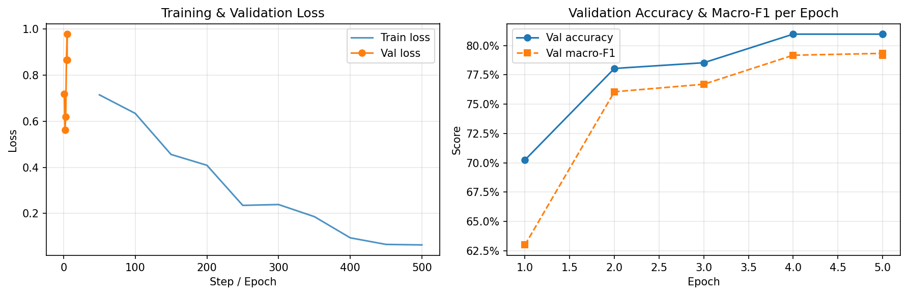
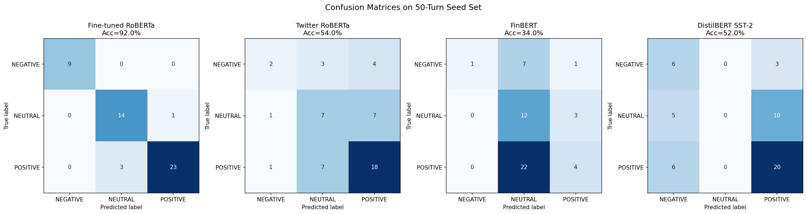

# NBA Playoff Press Conference Sentiment Analyzer

An end-to-end NLP pipeline that collects NBA playoff press conference transcripts, fine-tunes a transformer model on sports-specific language, and investigates whether post-game sentiment correlates with in-series performance outcomes.

---

## Research Question

> **Does post-game sentiment in NBA playoff press conferences correlate with in-series performance outcomes?**

Secondary questions:
- Does negative post-game sentiment predict elimination in the next game?
- How does coach sentiment shift when facing elimination vs. holding a series lead?
- Do coaches and players express sentiment differently after the same game?
- Which coaches have the most distinctive sentiment signatures across playoff runs?

This is a data science project with a research angle - not just an NLP demo. The correlation analysis uses Pearson correlation, logistic regression, and trajectory analysis to surface genuine findings.

---

## Key Results (Phases 1-3 complete)

### Corpus
- **2,790 transcripts** scraped from ASAP Sports (Conference Finals + NBA Finals, 2013-2022)
- **23,166 speaker turns** extracted (coach and player answers >= 10 words)

### Sentiment Model Performance (on 50-turn hand-labeled seed set)

| Model | Accuracy | Macro-F1 | Notes |
|-------|----------|----------|-------|
| **Fine-tuned RoBERTa (ours)** | **92.0%** | **0.932** | Trained on 2,050 sports-domain turns |
| Twitter RoBERTa (baseline) | 54.0% | 0.467 | Best off-the-shelf model |
| DistilBERT SST-2 (baseline) | 52.0% | 0.380 | 2-class only |
| FinBERT (baseline) | 34.0% | 0.288 | Skews NEUTRAL on sports text |

Off-the-shelf models top out at 54% because sports language has a distinct domain gap - phrases like "we got killed out there" or analytical post-win commentary confuse general sentiment models. Fine-tuning on GPT-4o-mini weak labels + 50 hand-labeled seed turns closed the gap from 54% to 92%.

### Training Curves



Early stopping (patience=2) selected epoch 4 as the best checkpoint - val accuracy peaked at 81% on the held-out validation set before overfitting set in.

### Confusion Matrix



The fine-tuned model achieves perfect recall on NEGATIVE turns. Remaining errors (4/50) are POSITIVE/NEUTRAL confusions - analytically-phrased post-win commentary that reads neutral in surface form but is positive in context.

---

## Pipeline

```
asapsports.com                     Kaggle games.csv
(Conference Finals + NBA Finals,   (playoff games, 2013-2022)
 2013-2022)
        |                                  |
        v                                  |
  src/scraper/asap_scraper.py              |
        |                                  |
        v                                  v
  data/processed/transcripts.csv          |
        |                          data/kaggle/games.csv
        v                                  |
  src/nlp/preprocess.py                    |
  (speaker turn extraction)                |
        |                                  |
        v                                  |
  data/processed/speaker_turns.csv         |
        |                                  |
        v                                  v
  src/training/                    src/analysis/
  (fine-tuned model inference)     (Pearson, logistic regression,
        |                           trajectory analysis)
        v                                  |
  data/processed/sentiment_scores.csv      |
                |                          |
                v                          v
            api/ (FastAPI) -----> frontend/ (React)
```

---

## Project Structure

```
press-conference-sentiment-analyzer/
├── data/
│   ├── raw/transcripts/              # Cached HTML from ASAP Sports (gitignored)
│   ├── kaggle/                       # Pre-downloaded Kaggle CSVs (gitignored)
│   └── processed/
│       ├── transcripts.csv           # 2,790 scraped transcripts
│       ├── speaker_turns.csv         # 23,166 speaker turns (>= 10 words)
│       ├── labels_seed.csv           # 50 hand-labeled turns
│       ├── baseline_predictions.csv  # 3-model baseline predictions on seed set
│       ├── weak_labels.csv           # 2,000 GPT-4o-mini labels
│       └── training_labels.csv       # Combined 2,050-turn training set
├── notebooks/
│   ├── 01_data_exploration.ipynb     # Corpus stats, speaker breakdown
│   ├── 02_baseline_models.ipynb      # Baseline comparison, domain gap analysis
│   └── 03_finetune_evaluation.ipynb  # Training curves, confusion matrices, error analysis
├── src/
│   ├── scraper/
│   │   ├── asap_scraper.py           # ASAP Sports crawler (numeric ID-based)
│   │   └── game_data.py              # Kaggle CSV loader, playoff game filter
│   ├── nlp/
│   │   ├── preprocess.py             # Speaker turn extraction, date parsing
│   │   └── sentiment.py              # BaselinePredictor, run_all_baselines()
│   └── training/
│       ├── label.py                  # GPT-4o-mini weak labeling with checkpointing
│       ├── dataset.py                # HuggingFace DatasetDict builder
│       └── finetune.py               # Trainer fine-tune + MLflow logging
├── models/
│   └── fine-tuned-sports-sentiment/  # Saved model weights (gitignored, hosted on HF Hub)
├── mlruns/                           # MLflow experiment tracking (gitignored)
├── api/                              # FastAPI backend (planned)
├── frontend/                         # React dashboard (planned)
└── requirements.txt
```

---

## Setup

### Prerequisites

- Python 3.9+
- `OPENAI_API_KEY` (only needed to re-run weak labeling; `weak_labels.csv` is committed)

### Install

```bash
python -m venv .venv
source .venv/bin/activate
pip install -r requirements.txt
```

### Run the pipeline

```bash
# 1. Scrape transcripts (already done - transcripts.csv committed)
python -m src.scraper.asap_scraper

# 2. Extract speaker turns
python -m src.nlp.preprocess

# 3. Run baseline models
python -m src.nlp.sentiment

# 4. Generate weak labels (requires OPENAI_API_KEY)
export OPENAI_API_KEY=sk-...
python -m src.training.label

# 5. Build training dataset
python -m src.training.dataset

# 6. Fine-tune model
python -m src.training.finetune

# 7. Launch MLflow UI
mlflow ui
```

### Notebooks

```bash
jupyter lab
```

Open notebooks in order: `01_data_exploration` -> `02_baseline_models` -> `03_finetune_evaluation`.

---

## Methodology

### Data Collection
ASAP Sports uses numeric IDs for all pages - there is no path-based URL pattern. The scraper navigates a 4-level hierarchy (year index -> series index -> game index -> transcript) and caches raw HTML before parsing to support resumable crawls.

### Speaker Attribution
Transcripts use `SPEAKER NAME:` (all-caps before colon) for attribution. Speaker extraction only begins after the first `Q.` in each transcript to avoid matching event title lines like `NBA FINALS: CELTICS VS WARRIORS`.

### Weak Labeling
GPT-4o-mini labeled 2,000 speaker turns using a 3-class schema with sports-specific definitions. The labeler was validated on the 50-turn seed set first (accuracy logged before proceeding). Batching was 20 turns per API call with incremental checkpointing every 100 turns.

### Fine-tuning
Base model: `cardiffnlp/twitter-roberta-base-sentiment` (chosen as best baseline). Training: 5 epochs, lr=2e-5, linear warmup 10%, batch size 16, early stopping patience=2. Label mapping preserves the base model's original LABEL_0/1/2 ordering (NEGATIVE=0, NEUTRAL=1, POSITIVE=2) to leverage pre-trained weight alignment.

### Limitations
- Correlation analysis findings should not be interpreted as causal
- Seed set is 50 turns - evaluation results may not generalize
- Weak labels from GPT-4o-mini have ~15% uncertain cases (flagged with `gpt_confidence=0`)

---

## Phase Roadmap

- [x] Phase 1 - Data collection (2,790 transcripts)
- [x] Phase 2 - Baseline NLP (54% best baseline on seed set)
- [x] Phase 3 - Fine-tuning (92% accuracy, 0.932 macro-F1 on seed set)
- [ ] Phase 4 - Correlation analysis (Pearson, logistic regression, trajectory)
- [ ] Phase 5 - FastAPI + React dashboard
- [ ] Phase 6 - Deploy (Railway + Vercel + HuggingFace Hub)

---

## Tech Stack

| Layer | Tools |
|-------|-------|
| Scraping | Python, requests, BeautifulSoup |
| NLP | HuggingFace Transformers, PyTorch |
| Weak labeling | OpenAI GPT-4o-mini |
| Training | HuggingFace Trainer, MLflow |
| Analysis | pandas, scipy, statsmodels |
| API | FastAPI, uvicorn |
| Frontend | React, Vite |
| Data | Kaggle NBA game logs |
